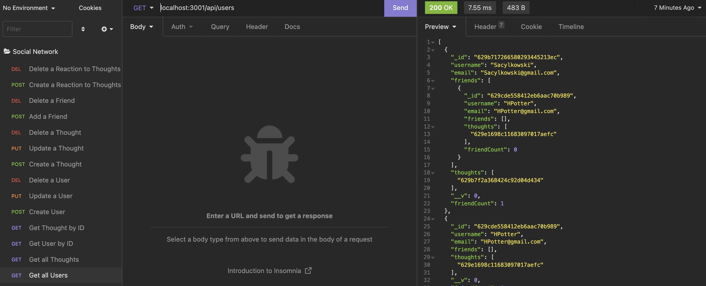

# Social Networking API

 ## Description
  This is an API for a social network web app where you can create users, have them share their thoughts, add friends and react to other's thoughts.  It is built with NoSQL. 

  ## Installation
  To install required dependecies, use: 
  `npm install` 

  ## Usage
  To run the app, go to your command line and enter: `npm start`   
  Use a program like Insomnia or Postman to test your routes.

  
  
  <a href="https://drive.google.com/file/d/1YNYAcQg8YTFS2JZl2YDwCc1ieN6qRMTv/view">Here is a video demo.</a>

 ## Built With
 This application is built with:  
 * Express.js
 * MongoDB
 * Mongoose
 * Moment.js

  ## Questions
  If you have any questions, please reach out on <a href="https://github.com/sacylkowski/">GitHub</a> or you can <a href="mailto:sacylkowski@gmail.com">E-mail me</a>.

